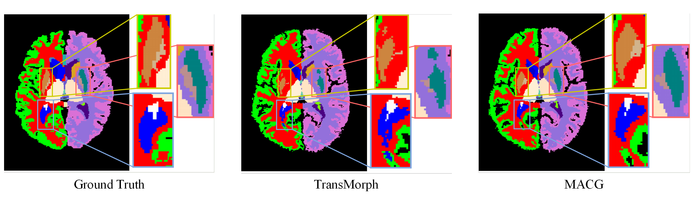
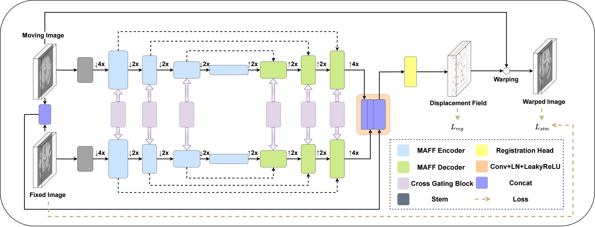
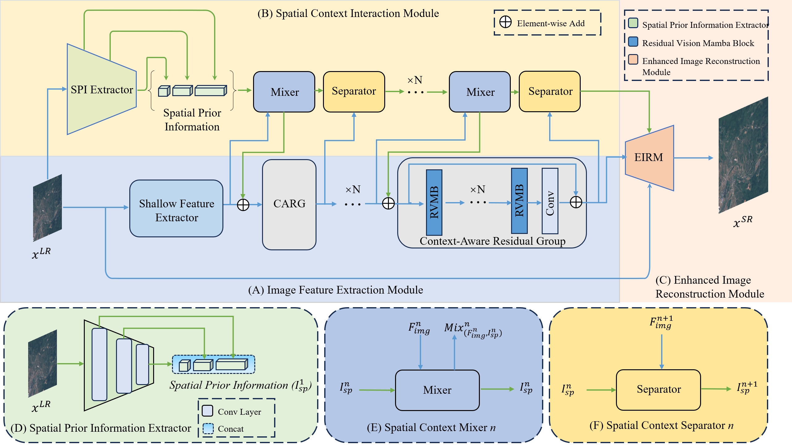

<head>
  <link rel="stylesheet" href="https://cdnjs.cloudflare.com/ajax/libs/font-awesome/5.15.4/css/all.min.css">
  
</head>

Computers in Biology and Medicine (IF:7.7) 

[MACG-Net: Multi-axis cross gating network for deformable medical image registration](https://www.sciencedirect.com/science/article/pii/S0010482524007583)

**W. Yuan**, J. Cheng, Y. H. Gong, L. He, J. Zhang#

- In this work, we propose MACG-Net, for deformable image registration. 

Remote Sensing (IF:5.0) 

[ESatSR: Enhancing Super-Resolution for Satellite Remote Sensing Images with State Space Model and Spatial Context](https://www.mdpi.com/2072-4292/16/11/1956)

Y. X. Wang†, **W. Yuan†**, X. Fang, B. J. Lin#

- In this work, we propose ESatSR, a novel SR method based on state space models. Tailored for remote sensing images, the interaction of multi-scale spatial context and image features is leveraged to enhance the network’s capability in capturing features of small targets. 

